## <ins> Homelab: Create a Mini Corporate Network with Active Directory </ins>  

  

---

Download Windows Server 2019 ISO: https://www.microsoft.com/en-us/evalcenter/download-windows-server-2019  
Download Windows 10 ISO: https://www.microsoft.com/en-us/software-download/windows10 [I will walk through the download process when I get to it or you can download now]

---

# <ins> Installing Windows Server 2019 </ins>  

- Open VirtualBox and click **New**  
- Enter a name for the server [I named it "Domain Controller" in accordance with best practices]  
- Select the **Windows Server 2019 ISO image**
- Under **Edition**, select **Windows Server 2019 Standard Evaluation (Desktop Experience)** to ensure the server installs with a GUI  
- Click **Finish** and allow the VM to start [This process may take some time]  

<ins> **After Windows Server 2019 installation, complete the following steps to improve performance:** </ins> 

- From the VirtualBox menu, select **Devices** → and click **Insert Guest Additions CD Image**  
- Open **File Explorer**, click on **This PC**, and double-click "CD Drive (D:) VirtualBox Guest Additions"  
- Double click and run **VBoxWindowsAdditions-amd64** to install the VirtualBox enhancements  
- When prompted, do not restart immediately. Instead, power off the VM  
  

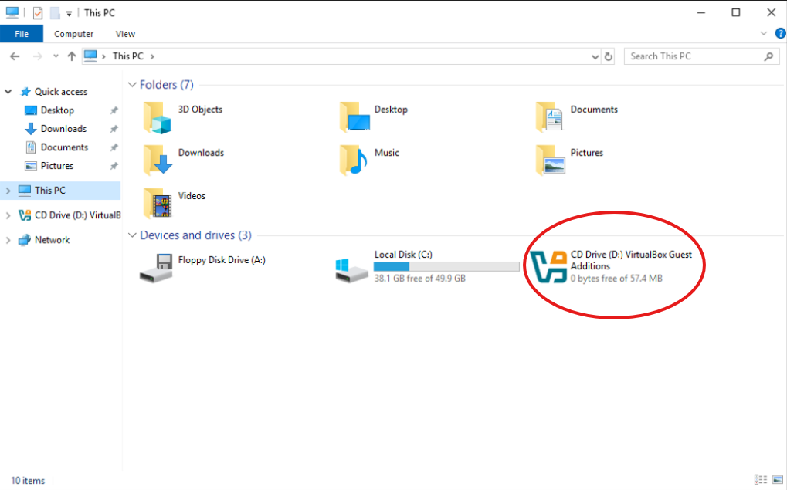  

---

In VirtualBox, select the VM and click the **Settings** cog.  

- Go to **Network** → **Adapter 2**  
- Check **Enable Network Adapter**  

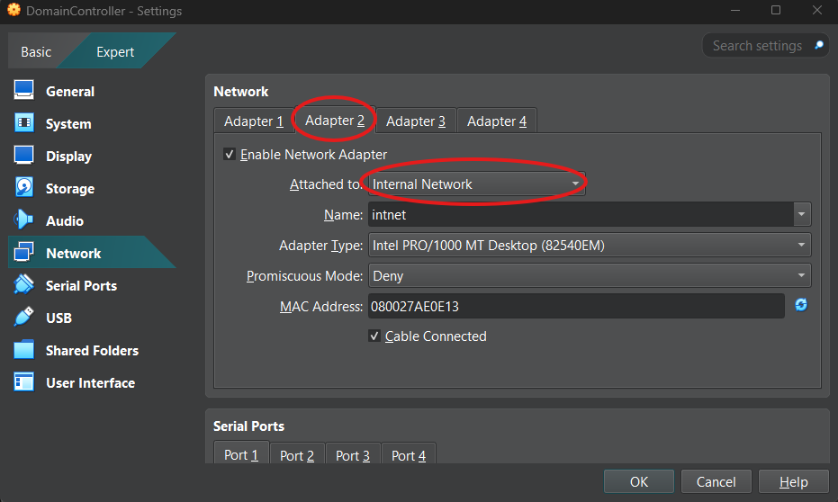  

Restart the VM.  

---

# <ins> Naming of the NICs </ins>  

To prevent confusion, rename the virtual NICs with descriptive names. [I used External & Internal following best practice]

- Open the Run dialog `Win + R`, type `ncpa.cpl`, and press Enter  
- Rename **Ethernet** to **External** (this adapter has internet access)  
- Rename **Ethernet 2** to **Internal** (this adapter is isolated from the internet)  

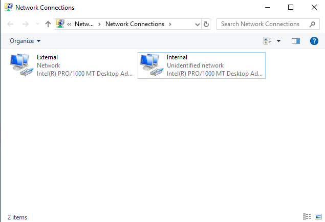  

---

# <ins> Renaming of the PC </ins>  

It is best practice to rename the computer for easier identification in your environment.  

- Right-click the **Start** menu  
- Select **System**  
- Click **Rename this PC**  

[I used the name **Domain Controller**]

---

# <ins> Change internal IP address </ins>  

Configure a static IP address on the internal network adapter:  

- Open the Run dialog (`Win + R`), type `ncpa.cpl`, and press Enter  
- Right-click the **Internal** adapter and select **Properties**  
- Select **Internet Protocol Version 4 (TCP/IPv4)** and click **Properties**  
- Choose **Use the following IP address:** and configure as follows:  
   - IP Address: `192.168.100.10`  [Come up with your own if preffered]
   - Subnet Mask: `255.255.255.0`  
   - Default Gateway: *(leave blank)*  
- Choose **Use the following DNS server addresses:** and enter `127.0.0.1`  
- Click **OK**, then apply the changes  

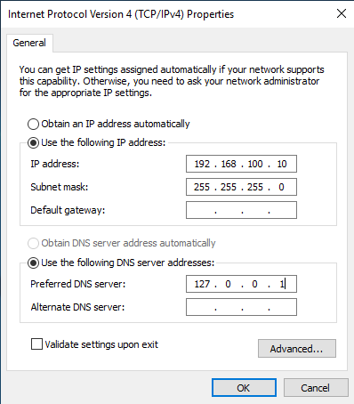  

---

# <ins> (AD DS) Active Directory Domain Services Setup </ins>  

- Open **Server Manager** (search if it is not already open)  
- Under **Configure this local server**, select **Add roles and features**  
- Click **Next** twice  
- From the **Server Pool**, select your server and click **Next**  
- Under **Select server roles**, check **Active Directory Domain Services**  
- Click **Next** twice, then click **Install**  

The installation will take several minutes:  

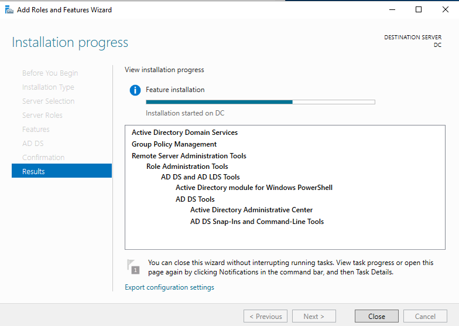  

Once installation completes, click **Close**.  

---

# <ins> Promoting Server to Domain Controller </ins>  

- In **Server Manager**, click the **Notifications** flag in the top-right corner (yellow icon)  
 <br>

- Select **Promote this server to a domain controller**  
- Choose **Add a new forest**  
- Enter a domain name (I used `domain.com`)  
- Set and confirm a Directory Services Restore Mode (DSRM) password, then click **Next**  
- Ignore any warnings and continue clicking **Next** until the **Install** button appears  
- Click **Install** (this step will take several minutes)  
- The VM will automatically restart once installation completes *(this will take a long time)*  

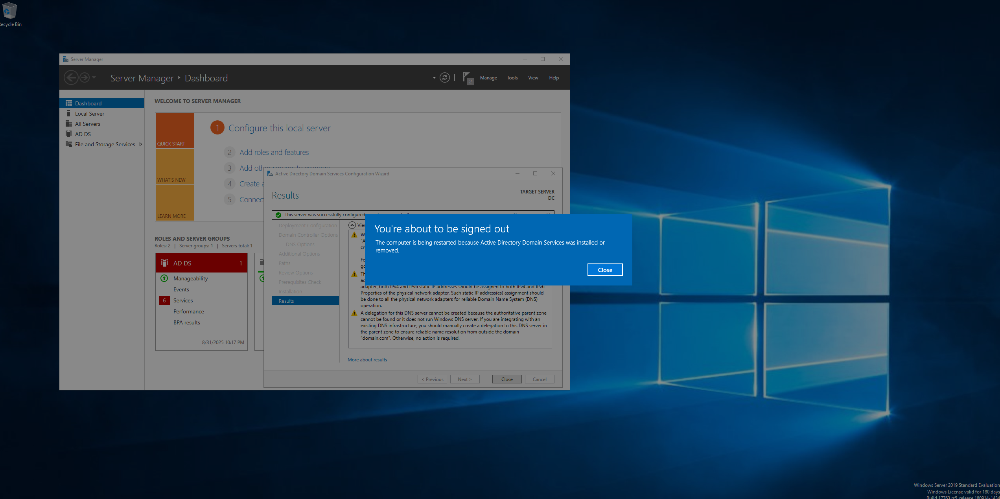  


---

# <ins> Create Domain Admin Account </ins>  

- On the AD DS dashboard, select **Tools** in the top right corner  
- Click **Active Directory Users and Computers** [be careful, there are a lot of options that look similar]  
- In the left panel, expand **domain.com**  

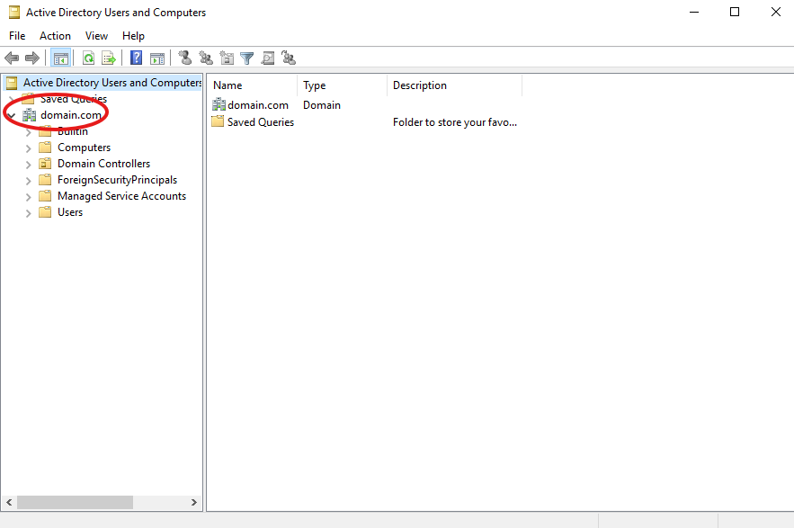 <br>  

- Right-click **domain.com**, click **New**, then click **Organizational Unit**  
- Name the OU (Organizational Unit) [I used **ADMIN**]  

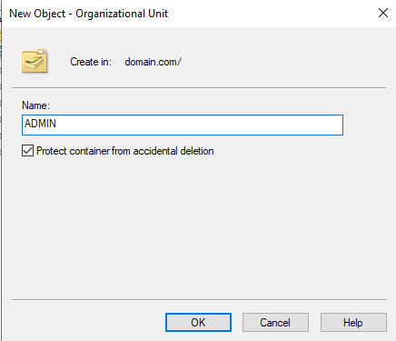 <br>  


**Now we want to add that Admin user to our new OU**  

- Right-click the **ADMIN** folder, select **New**, then click **User**  
- Enter the user’s **First name**, **Last name**, and **User logon name** [Following standard naming practices I recommend making the logon name the first initial and last name, for example `jdoe@domain.com`]  

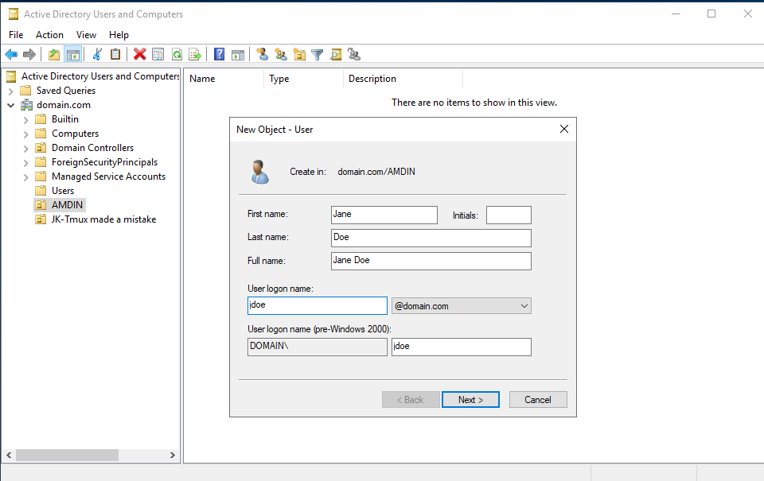 <br>  

- Click **Next** and set a password [You can uncheck *User must change password at next logon*, but in a professional setting it’s critical to leave it checked]  
- Click **Next**, then **Finish**  

**Now we need to change this standard user into an admin**  

- Right-click the user and select **Properties**  
- At the top, select **Member Of**  
- Click **Add** and type `domain admins`  
- Click **Check Name** to confirm, then click **apply** and **ok** [You should now see the user as a member of both **Domain Admins** and **Domain Users**]  

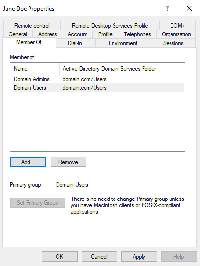 <br>  

---

# <ins> Testing the Admin User </ins>  

- To confirm the new admin account works, click the Windows icon in the bottom-left, select the user, and choose **Sign out**  
- `Ctrl+Alt+Delete` might not function correctly inside the VM. To get around this click **Input** &rarr; **Keyboard** &rarr; **Insert Ctrl-Alt-Del** *OR press `Host+Del` [on my VM, Host is mapped to Right Ctrl so `ctrl+del`]*
- On the login screen, enter the new user’s credentials:  
  - Username: `jdoe@domain.com` [You could also use `DOMAIN\jdoe` for the username, but this is the old format]  
  - Password: the one you configured previously  

---

# <ins> RAS/NAT Installation </ins>  

*RAS (Remote Access Service) and NAT (Network Address Translation) work together to enable secure remote connections to an internal network. RAS acts as a secure gateway for remote users, while NAT translates private internal IP addresses into a single public IP address for outgoing internet traffic.*  

- Using the Admin user account, open **Server Manager** and click **Add roles and features** under *Configure this local server*  
- Click **Next** twice until you reach the **Select server roles** section. Check **Remote Access**  

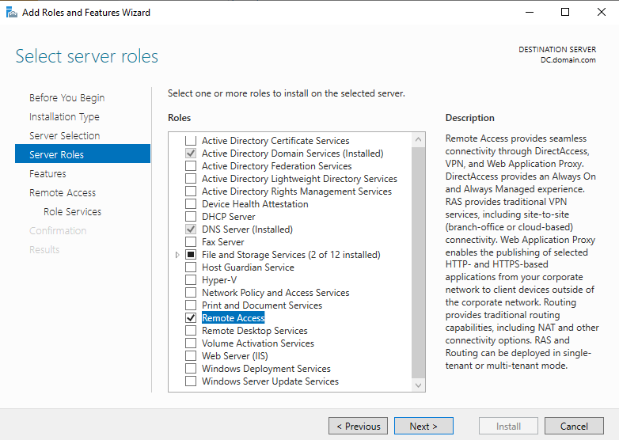 <br>  

- Click **Next** three times until you reach the **Select role services** section. Check **Routing** and click **Add Features**  
- Click **Next** three more times until you reach the **Confirm installation selections** section, then click **Install** [This part will take a while]  

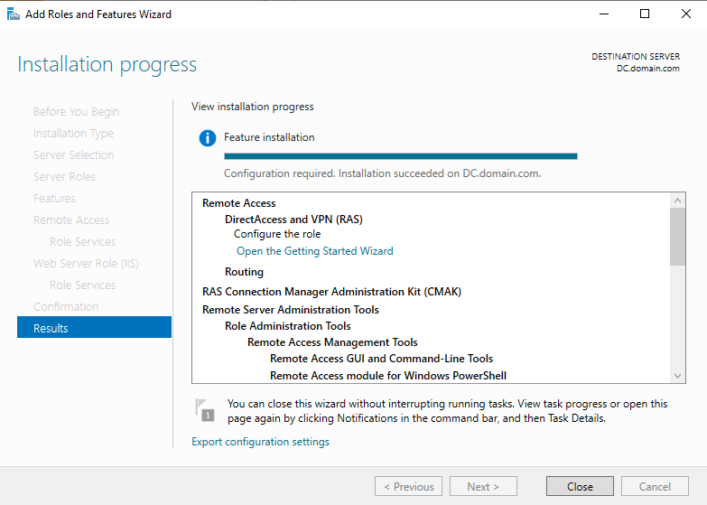 <br>  

- When installation completes, click **Close**  
- Restart the VM to ensure the changes take effect [If skipped, the next step may be buggy]  
- In **Server Manager**, go to **Tools** in the top-right corner and select **Routing and Remote Access**  
- Right-click **DC (local)** and select **Configure and Enable Routing and Remote Access**  
- Click **Next**, then choose **Network address translation (NAT)**  
- Click **Next** and check **Use this public interface to connect to the internet** [This step can be buggy—if the option does not appear correctly, restart the VM and try again]  
- Under **Use this public interface to connect to the internet**, select **External** (this is the NIC connected to the internet) → click **Next** → **Finish**  

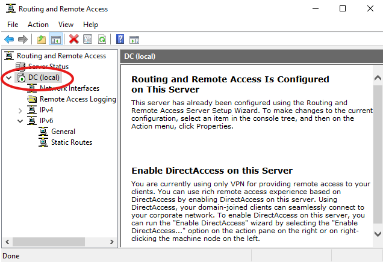 <br>  

- RAS and NAT are now configured  

---

# <ins> DHCP Server Setup </ins>  

*Setting up a DHCP server allows client computers to automatically receive an IP address and gain access to the internet through the Domain Controller.*  

- In **Server Manager**, under **Configure this local server**, click **Add roles and features**  
- Click **Next** until you reach the **Select server roles** section, then check **DHCP Server**  
- Click **Add Features**, then click **Next** three times until the **Install** button appears. Click **Install** [This might take a while]  

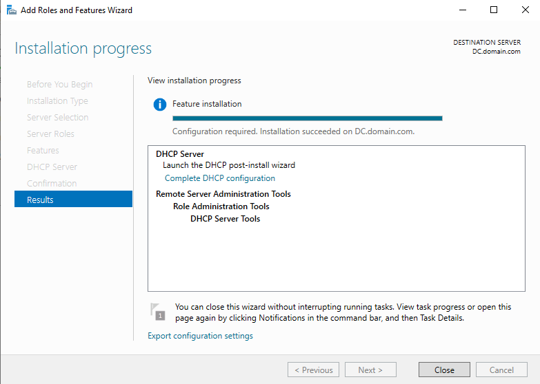 <br>  

- Once installation completes, click **Close**  
- In **Server Manager**, go to **Tools** (top-right) and select **DHCP**  

*Next, we need to define a DHCP IP address scope so client machines can connect to the network.*  

- In the DHCP window, right-click **IPv4** and select **New Scope...**  
- In the **Scope Wizard**, click **Next**, then enter a scope name [I like to name it after the actual IP range for clarity, so I used `192.168.100.20-192.168.100.200`]  
- Click **Next** and enter the starting and ending IP address range  

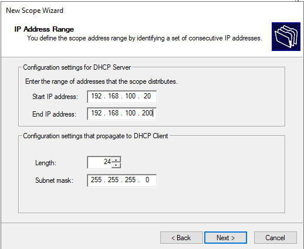 <br>  

- The Length and Subnet mask fields auto-populate. Click **Next**  
- (Optional) Add IP exclusions for addresses you don’t want auto-assigned (e.g., router, printers). [This time I did not add any exclusions.] 
- Click **Next**  
- (Optional) Set an IP lease duration, or click **Next** to accept the default [For personal projects I don’t alter the lease duration]  
- At the **Configure DHCP Options** screen, ensure **Yes, I want to configure these options now** is selected, then click **Next**  
- Enter the IP address originally assigned to the Internal NIC, click **Add**, then click **Next** [The VM’s Internal NIC will act as a router]  
- Continue clicking **Next** until the **Finish** button appears, then click **Finish**  
- In the DHCP console, right-click the domain (e.g., `dc.domain.com`) and select **Authorize**  
- Right-click the domain again and select **Refresh**  
- A green check mark should now appear on both **IPv4** and **IPv6** under the domain. 
- Next, navigate to **IPv4** on the left and expand it if it is not already &rarr; right click on **Server Options** &rarr; click **Configure Options**
- Check the box for **003 Router** and enter the Domain Controller IP address in the IP address box. [Mine was `192.168.100.10`]
- Click **Add** &rarr; **Apply**
- Right click the server (dc.domain.com) &rarr;**All Tasks** &rarr;**Restart**

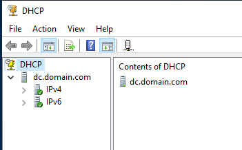 <br>  

---

# <ins> Adding Test Users </ins>  

*To make the environment more realistic and provide accounts for testing, we will add some sample users. One user will be created manually, and the rest will be added using a PowerShell script.*  

- To add a user manually, open the **Server Manager dashboard**, click **Tools** in the top right, then select **Active Directory Users and Computers**  
- Right-click the **Users** folder → **New** → **User**  
- Complete the user information fields. Be sure to use the same naming format used previously for the **User logon name:** (e.g., `jdoe@domain.com`), then click **Next**  
- Enter the password information → **Next** → **Finish**  

- To bulk add additional users, we will use PowerShell.  

   - Enable bidirectional copy and paste so you can transfer code from your host system into the VM:  
      - From the top menu of the VM window, click **Devices** → **Shared Clipboard** → **Bidirectional**  

- Open an elevated PowerShell session:  
   - Search for **PowerShell** → right-click → **Run as administrator**  

- Copy and paste the following PowerShell script into the window:  

```powershell
# PowerShell script to add a new user to Active Directory 
# Run in elevated PowerShell

Import-Module ActiveDirectory

# Array of user info
$users = @(
    @{Name="Alice Johnson"; Given="Alice"; Surname="Johnson"; Sam="ajohnson"; UPN="ajohnson@domain.com"},
    @{Name="Bob Smith"; Given="Bob"; Surname="Smith"; Sam="bsmith"; UPN="bsmith@domain.com"},
    @{Name="Charlie Brown"; Given="Charlie"; Surname="Brown"; Sam="cbrown"; UPN="cbrown@domain.com"},
    @{Name="Diana Prince"; Given="Diana"; Surname="Prince"; Sam="dprince"; UPN="dprince@domain.com"},
    @{Name="Ethan Hunt"; Given="Ethan"; Surname="Hunt"; Sam="ehunt"; UPN="ehunt@domain.com"},
    @{Name="Fiona Davis"; Given="Fiona"; Surname="Davis"; Sam="fdavis"; UPN="fdavis@domain.com"},
    @{Name="George Miller"; Given="George"; Surname="Miller"; Sam="gmiller"; UPN="gmiller@domain.com"},
    @{Name="Hannah Lee"; Given="Hannah"; Surname="Lee"; Sam="hlee"; UPN="hlee@domain.com"},
    @{Name="Isaac Wright"; Given="Isaac"; Surname="Wright"; Sam="iwright"; UPN="iwright@domain.com"},
    @{Name="Julia Clark"; Given="Julia"; Surname="Clark"; Sam="jclark"; UPN="jclark@domain.com"}
)

# Common OU Path (adjust for your AD domain if you don't want it to go to default Users container)
$ouPath = "CN=Users,DC=domain,DC=com"

# Default password for all users (change to policy-compliant)
$password = ConvertTo-SecureString "P@ssword123!" -AsPlainText -Force

# Create users
foreach ($u in $users) {
    New-ADUser `
        -Name $u.Name `
        -GivenName $u.Given `
        -Surname $u.Surname `
        -SamAccountName $u.Sam `
        -UserPrincipalName $u.UPN `
        -Path $ouPath `
        -AccountPassword $password `
        -Enabled $true `
        -ChangePasswordAtLogon $true
    Write-Output "Created user: $($u.Name)"
}
```
- Once the script completes, if the new users are not immediately visible, return to the **Active Directory Users and Computers** window → **Action** → **Refresh**  
- *The script sets all user passwords to `P@ssword123!` and requires them to change it at first login*  
- The result should look like the image below:  

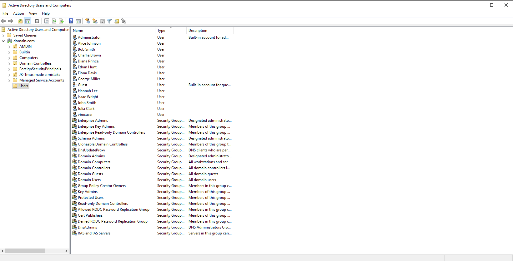 <br>  

---

# <ins> Windows 10 Client Computer Installation and Configuration </ins>  

*We are now ready to set up the Windows 10 client computer. It will obtain its IP address automatically from the DHCP server configured earlier.*  

Download Windows 10 ISO: https://www.microsoft.com/en-us/software-download/windows10 

- Navigate to the link above and click **Download Now**. This will download an executable named **MediaCreationTool_22H2.exe**. Double-click to run  
- Click **Yes** → **Accept** → select "Create installation media for another PC" → **Next** → select "ISO file" → **Next**, then save it to your desired location [This may take some time]  
- Once the ISO download completes, click **Finish**  

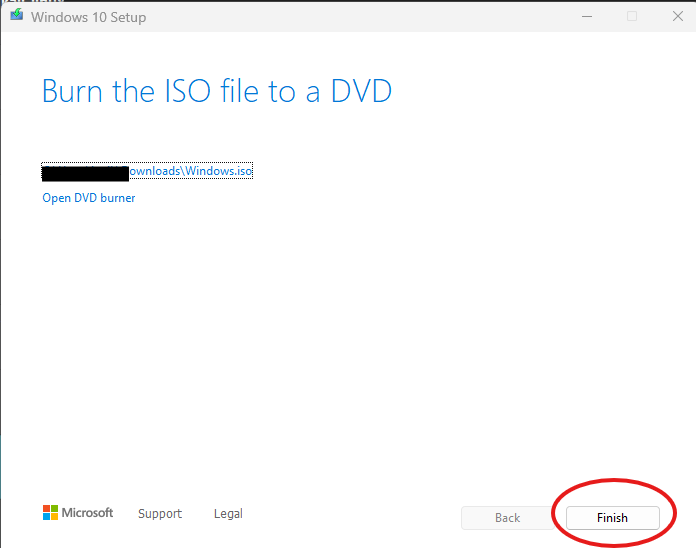 <br>  

- In VirtualBox Manager, click **New**  
- Provide a name for the VM, select a save location, choose the ISO image you just created, then click **Next** [Note: the default username is `vboxuser` and the password is `changeme`]  
- Click **Next** and configure the resources. A minimum of "4096MB (4GB)" RAM and "4 CPUs" is recommended [I use "8192MB (8GB)" RAM and "4 CPUs" for improved performance]  
- Click **Next**, adjust the Virtual Hard Disk size if desired, then click **Next** → **Finish**  
- Select the new VM, open **Settings**, and go to **Storage**. Under "Controller: Floppy", select "Unattended" and click the **Delete** icon  
- Still in **Settings**, navigate to the **Network** tab. For Adapter 1 "Attached to", change "NAT" to **Internal Network**, then click **OK**  
- Start the VM and begin the installation. At the "Activate Windows" screen, select **I don't have a product key**  
- Select "Windows 10 Pro" [Windows 10 Home does not support domain join] → **Next**  
- Accept the license terms → **Next** → select "Custom: Install Windows only (advanced)"  
- Click **Next** to continue [Installation will take several minutes]  
- After reboot, choose your region → **Yes**, choose keyboard layout → **Yes**, then click **Skip** when prompted for a second layout  
- At the network screen, select **I don't have internet** → **Continue with limited setup**  
- At "Who’s going to use this PC?" enter a username [I used `Generic`] → at the password screen, click **Next**  
- At "Choose privacy settings for your device", deselect all options and click **Accept** [Optional, but recommended to disable all for simplicity]  
- At the Cortana setup screen, click **Not now**  
- Windows will finalize the configuration [This may take several minutes]  
- Close the Microsoft Edge advertisement 
 
*At this point, the Windows 10 client is fully installed and ready to be joined to the domain*

---

# <ins> Testing the Windows 10 Client Internet Connectivity </ins>  

*With the Windows 10 client installed and configured, the next step is to verify that it is receiving an IP address from the DHCP server and has proper network connectivity.*  

- On the Windows 10 Client computer, open **CMD (Command Prompt)**  
- In CMD, type `ipconfig` and press Enter. You should see values for IPv4, Subnet Mask, and Default Gateway [If no default gateway appears, the DHCP server configuration is incorrect and you will need to repeat those steps]  

It should look similar to the example below:  

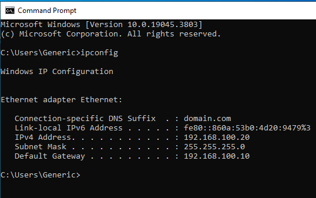 <br>  

*At this point, the Windows 10 client is successfully obtaining an IP configuration from the DHCP server. This confirms that the DHCP and NAT services on the Domain Controller are functioning correctly, and the client is ready to be joined to the domain.*  

---

# <ins> Joining Windows 10 Client to the Domain </ins>  

*Now that the Windows 10 client has network connectivity, the next step is to rename the PC and join it to the Active Directory domain.*  

- Right-click the Windows icon and select **System**, then scroll down and click **Rename this PC (advanced)**  
- Do NOT type the name in the "Computer description" field. Instead, click **Change...**  
- Enter the new **Computer name:** [I used the name Client]  
- Under **Member of**, deselect "Workgroup" and select **Domain**. In the **Domain** field, enter the domain name you created earlier in AD [I used domain.com], then click **OK**  
- When prompted, enter the username and password of the admin account created in AD [I used `jdoe@domain.com`]  
- A confirmation box should appear stating: "Welcome to the domain.com (or your chosen domain) domain." Click **OK**  

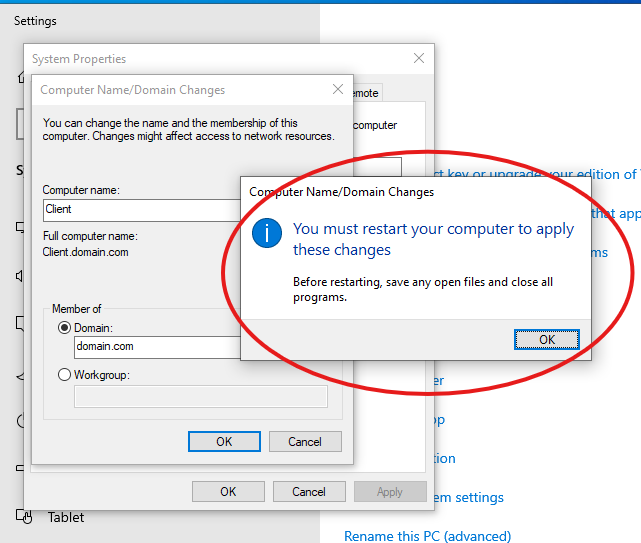 <br>  

- Click **OK** to restart the computer → hit **Close** on the remaining window → then select **Restart Now**  
- Once the VM restarts, log back in. Since we did not configure a password earlier, simply press the right arrow at the password screen  

*At this point, the Windows 10 client has been successfully joined to the Active Directory domain and is now managed by the Domain Controller.*  

# <ins> Verifying DHCP Lease Assignment via the Domain Controller </ins>  

*After joining the client to the domain, the next step is to verify that it has been properly assigned an IP lease by the DHCP server.*  

- Minimize the Client VM and maximize the DC VM  
- In **Server Manager**, navigate to **Tools** (top right) and select **DHCP**  
- Expand the server on the left (dc.domain.com) → expand **Scope** → select **Address Leases**. The client computer should now be listed with its assigned IP address  

onetimepassword_client
*This confirms that the Domain Controller is successfully providing IP leases to clients via DHCP and that the Windows 10 client is connected to the domain network.*  

# <ins> Testing Client Access Through Domain User Accounts </ins>  

*The final step is to verify that domain user accounts can successfully log in to the Windows 10 client. This ensures authentication is working correctly between the client and the Domain Controller.*  

- Minimize the Domain Controller and maximize the Client VM  
- If logged in, sign out. On the login screen, click **Other user** in the bottom-left corner  
- Log in with one of the accounts created earlier (either manually or via the PowerShell script). The one-time password specified in the script is `P@ssword123!` [I used `ajohnson@domain.com` as the test user]  
- Because the script enforces a one-time password, the user will be prompted to change it on first login [this follows best practices]. Click **OK** to proceed  

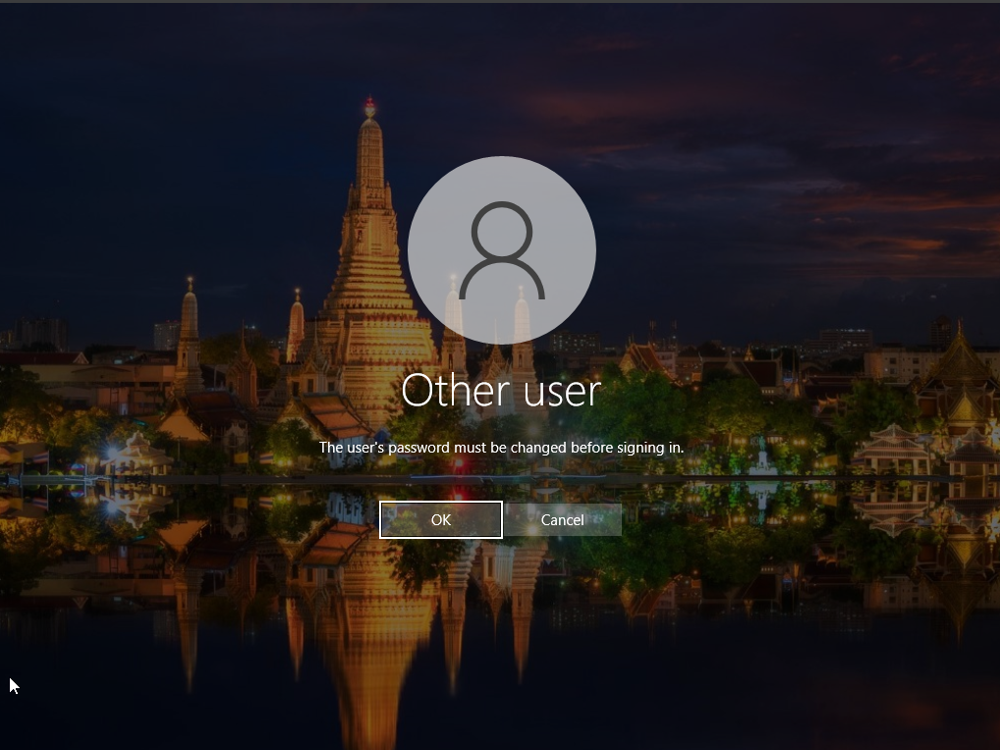 <br>  

*At this stage, we have successfully built a functioning domain environment. The Windows 10 client represents an employee workstation, while the Domain Controller provides centralized authentication, DHCP, and network services—forming the foundation of a corporate network.*  

# <ins> Conclusion </ins>  

*By following this walkthrough, we have built a functional homelab environment that simulates the core infrastructure of a corporate network.*  

### Accomplishments:  
- Installed and configured **Windows Server 2019** as a Domain Controller  
- Set up **Active Directory Domain Services (AD DS)** for centralized authentication  
- Configured **RAS/NAT** for internal-to-external connectivity  
- Installed and configured the **DHCP server** to automatically assign client IP addresses  
- Created and managed **domain user accounts**, including an Admin account and bulk users via a PowerShell script  
- Installed and configured a **Windows 10 client computer**  
- Verified client connectivity, DHCP lease assignment, and successful domain authentication  

### Outcome:  
The Windows 10 client now represents an employee workstation, and the Domain Controller provides authentication, DHCP, and network services. Together, they form the foundation of a small-scale corporate network that can be expanded and customized for further learning.  

*This environment can now serve as a platform to explore more advanced topics such as Group Policy Objects (GPOs), DNS, and security hardening practices.*  

  
